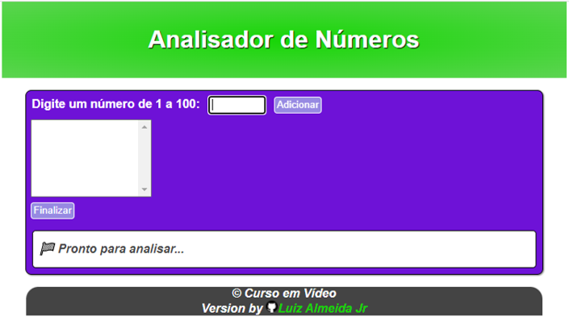
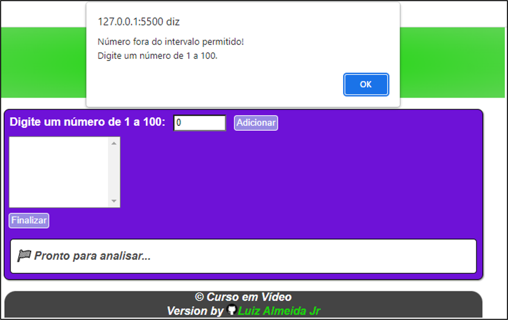
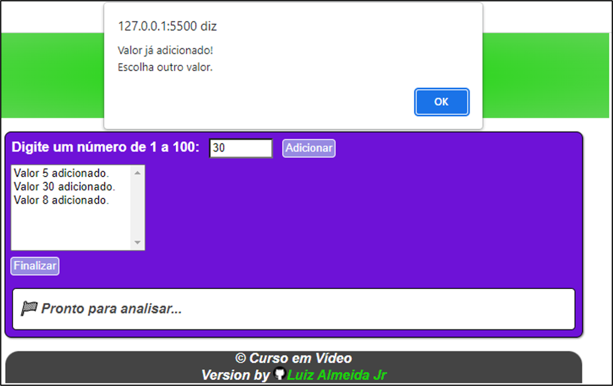
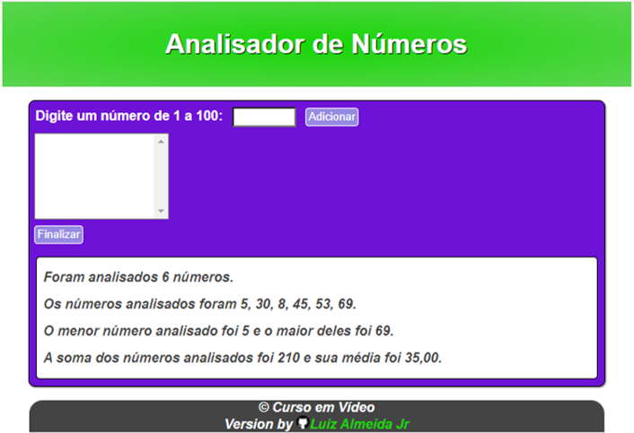

# 🔢 Analisador de Números

Programa responsável por analisar os números adicionados e retornar o maior e o menor entre eles, a soma de todos os números e sua média.
 

Programa desenvolvido durante desafio do curso de JavaScript do Curso em Vídeo.

##  Como utilizar?
Digite um número de 1 a 100 e clique em **Adicionar**.

 

 

Há validações para que não seja inserido nenhum número fora do intervalo especificado.

 

 

E para que não sejam inseridos números repetidos.

 

 

Após a adicão de todos os números desejados e clicando em **Finalizar**, são exibidos os resultados da análise dos números.

 

 

## 🛠 Tecnologias

## Autor

<strong> Luiz Almeida Jr</strong>

## 📝 License
This project is MIT licensed.